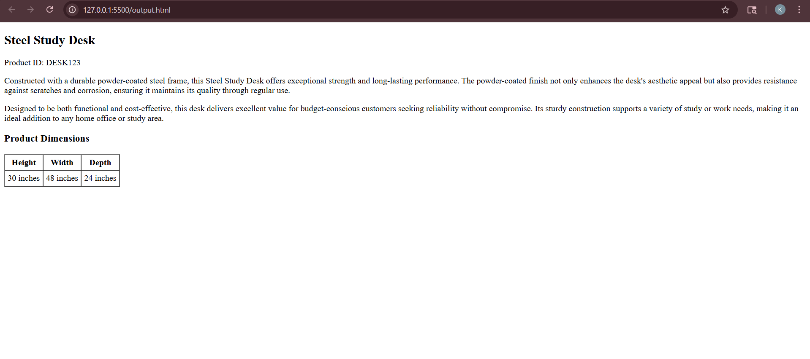

# 🛍️ AI Product Description Generator

This project uses OpenAI API and prompt engineering techniques to generate structured product descriptions for retail websites.

## 🚀 Features
- Generates product descriptions from raw specifications
- Outputs clean HTML for direct website use
- Highlights materials, durability, and budget-friendly value
- Automatically creates a product dimensions table

## 🛠️ Tech Stack
- Python
- OpenAI API
- Prompt Engineering
- HTML generation
- Streamlit (optional UI)

## ▶️ How to Run

```bash
pip install -r requirements.txt
python app.py
```
## 📸 Demo

